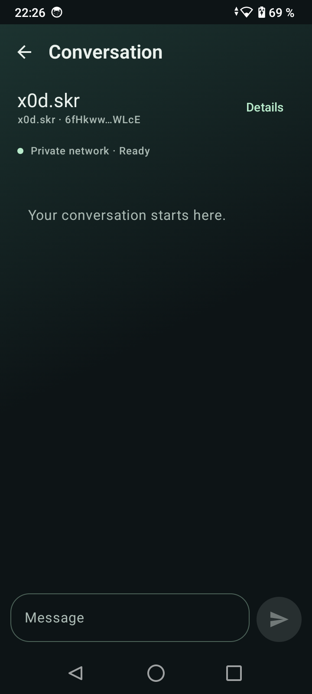
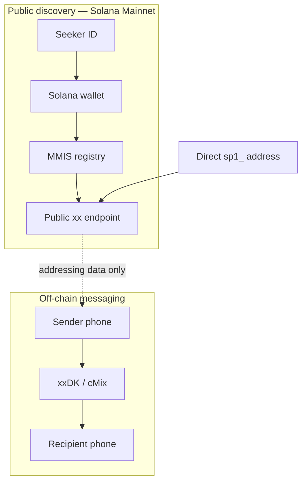

# Money Moves in Silence

**Private messaging for Solana wallets and Seeker IDs.**

Type a `.skr` name or Solana wallet. MMIS discovers its public messaging endpoint on Solana Mainnet. The conversation travels through xxDK/cMix; messages and conversation history are not stored on-chain.

**Android 10+ · Validated on Solana Seeker · Hackathon / beta**

[Website](https://narayanasupramati.github.io) · [Download APK](https://github.com/NarayanaSupramati/mmis/releases/download/v0.3.3-demo/mmis-0.3.3-demo.apk) · [Release notes](https://github.com/NarayanaSupramati/mmis/releases/tag/v0.3.3-demo) · [Pitch deck (PDF)](https://narayanasupramati.github.io/mmis-hackathon-deck.pdf) · Demo coming shortly

<!-- DEMO_URL: pending. Replace the text above with the actual video link. DECK_URL: published PDF above. -->

```text
DISCOVERY   x0d.skr → Solana wallet → Mainnet registry → xx endpoint
MESSAGING   Your phone ──────────── xxDK / cMix ──────── Recipient
```



*Actual Android UI, before sending. A clean message-exchange video is pending.*

## Why Solana?

A wallet gives users a portable public identity. MMIS adds a small public registry mapping **wallet → xx messaging endpoint**. This is discovery and control-plane state, separate from message transport. Connecting a wallet does not automatically publish a listing; enabling it requires an explicit wallet transaction.

The registry association is public and historically observable. Wallet identity and xx identity are independent. `.skr` is an address alias, not an encryption key.

## Three ways to start a conversation

| Address | Resolution |
|---|---|
| Seeker ID, such as `x0d.skr` | `.skr` → wallet → registry → xx endpoint |
| Solana wallet, such as `6fHk…WLcE` | wallet → registry → xx endpoint |
| Direct address, `sp1_…` | decodes the xx endpoint; bypasses the Solana registry |

Direct mode still needs the messaging network, but not registry availability. A wallet is optional for direct messaging.

## What works today

- Mainnet recipient discovery and Mobile Wallet Adapter integration.
- xxDK/cMix messages, local conversation history and contact aliases.
- QR sharing/scanning and foreground incoming-message banners.
- Encrypted messaging identity/history backup and restore.
- Local conversation deletion and explicit retry controls.
- Android 10+; validated on a physical Solana Seeker.

## Architecture



[Architecture](docs/architecture.md) · [Registry](docs/registry.md) · [Privacy model](docs/privacy-model.md)

## Mainnet registry

**Solana Mainnet · Registry protocol v1 · Upgradeable beta**

Program: `MmisXGzDeJbPeK9uMDpqYxQ3ED7xsjYahP9rS5AvuYz`

[Public deployment metadata](registry/deployments/mainnet.json). The program is upgradeable, not immutable.

## Try it

The verified Android beta is **0.3.3-demo**, code **13**. [Download the official APK from GitHub Releases](https://github.com/NarayanaSupramati/mmis/releases/download/v0.3.3-demo/mmis-0.3.3-demo.apk). The APK is a Release asset and is not committed to source history.

Install the official APK on Android 10+ with a supported 4 KB page-size device, create or restore a messaging identity, and wait for private network Ready. Choose **New**, enter an address or scan its QR, review the recipient, then open a chat. For your own public listing, connect a Mainnet wallet and explicitly enable messaging. Wallet approval can incur Mainnet fees.

Verify the APK with Android SDK build-tools:

```sh
apksigner verify --verbose --print-certs mmis-0.3.3-demo.apk
```

Package: `network.mmis.runtime`  
Official signing certificate SHA-256:

```text
16:08:DF:41:E6:5B:EE:06:02:51:48:AE:A3:08:73:CF:13:0A:3A:8D:83:F8:57:6B:4D:BD:28:34:8C:C3:30:2A
```

APK SHA-256:

```text
d15bb0299540a6a89718cdeae68628a86062161fa2885d49c3b40952f86a7f6c
```

[Release notes](docs/release-notes.md) · [Machine-readable metadata](release.json)

## Beta limitations

- Notifications are foreground banners; no system/background notifications.
- Send attempts can fail, time out or arrive late. Delivery is not guaranteed; avoid assuming a timed-out attempt was never received.
- **Sent to network** is not a Delivered or Read receipt.
- Registry bindings and `.skr` ownership are public. MMIS makes no absolute anonymity or zero-metadata claim.
- Local history is app-private plaintext on the device; encrypted export does not encrypt the live database.
- Android only. Compatibility with 16 KB page-size kernels is not claimed.
- Public RPC availability/rate limits can affect discovery. Direct addressing bypasses registry lookup.

## Build

JDK17, Android SDK36/build-tools35.0.0; Gradle8.13 wrapper included. The pinned xxDK AAR is included and hash-checked. From the repository root:

```sh
cd android-runtime-probe
./gradlew testDebugUnitTest assembleDebug
```

On Windows use `gradlew.bat`. Debug uses the Lab/devnet profile and local Debug signing. Official Release/Hackathon APKs use Mainnet and the production certificate; private signing material is not included. See [portable build instructions](docs/build.md) for all profiles, registry builds and native provenance.

## Source layout and license

`android-runtime-probe/` contains the Android app (historical directory name); `registry/` contains the Solana program; `docs/` contains public documentation and selected protocol fixtures; `scripts/` contains build support.

MMIS-owned code and documentation: [MIT](LICENSE). Dependencies retain their own licenses; see [third-party notices](third-party/README.md).
