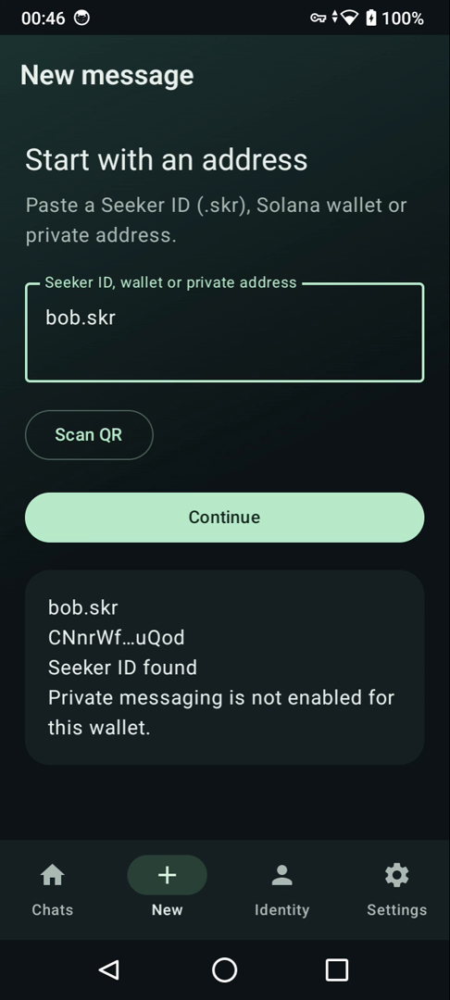
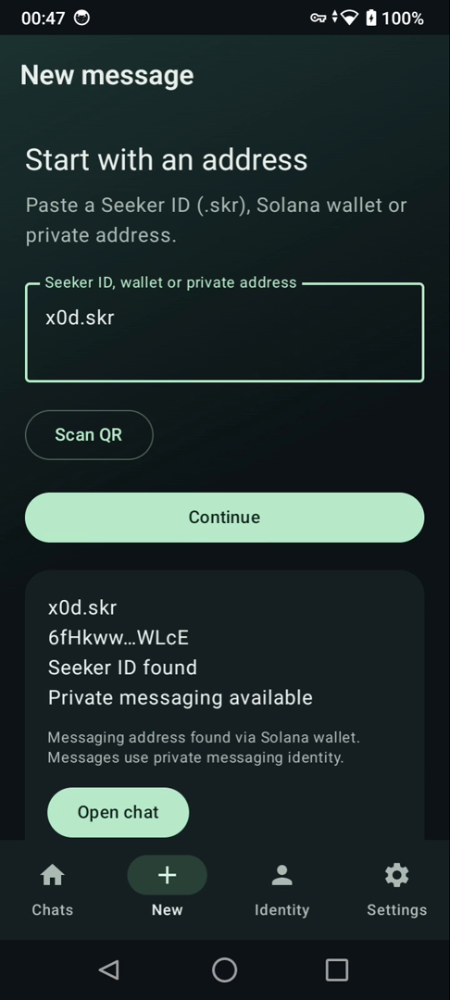
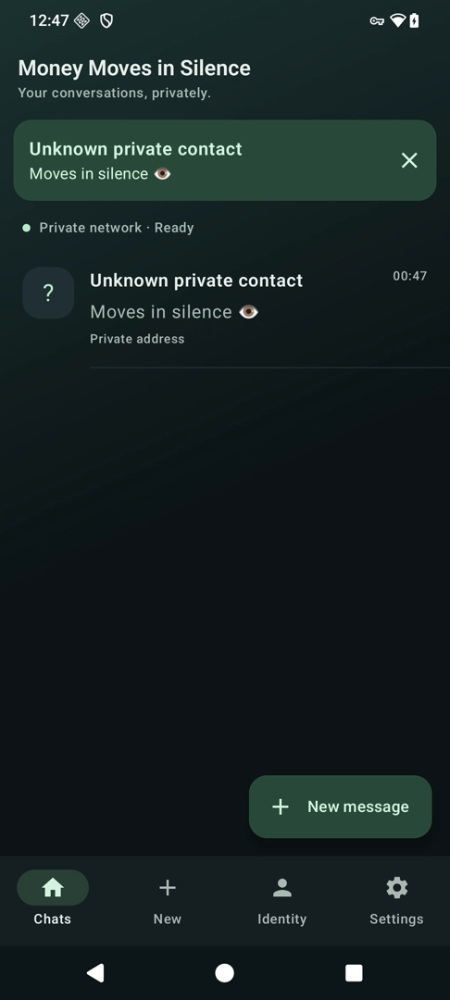

# Product screenshots

Real Android screens from the recorded MMIS demo. Lookup results describe the state at capture time; a wallet owner can later enable or change its messaging endpoint.

## Seeker ID found, messaging not enabled

The `bob.skr` lookup finds a Seeker ID, but private messaging is not enabled for the resolved wallet. Finding a name alone does not mean a messaging endpoint is available.

## Seeker ID with messaging available

The `x0d.skr` lookup resolves the name to a wallet and finds its messaging endpoint through the Solana Mainnet registry. The user can then open a chat; message content travels through xxDK/cMix off-chain.

## Incoming message on Seeker

The foreground banner and Chats preview show the received demo message, “Moves in silence.” The sender is displayed as an unknown private contact. This is an in-app banner, not a background push notification or a verified sender name.

## Conversation before sending

The screenshot below shows an empty `x0d.skr` conversation, before sending.

## Full product demo

The [2-minute 50-second demo (MP4)](https://github.com/NarayanaSupramati/mmis/releases/download/v0.3.3-demo/mmis_demo.mp4) shows messaging identity creation on Seeker, wallet connection, enabling private messaging, Seeker ID lookup, and a real message exchange between two Android phones. It also demonstrates saving a local contact name.

The stills above show lookup and incoming-message states. The full video also shows the reply arriving on the sender's phone. “Sent to network” is not a delivery or read receipt.

The video is a GitHub Release download; your browser may download it instead of playing it inline.
